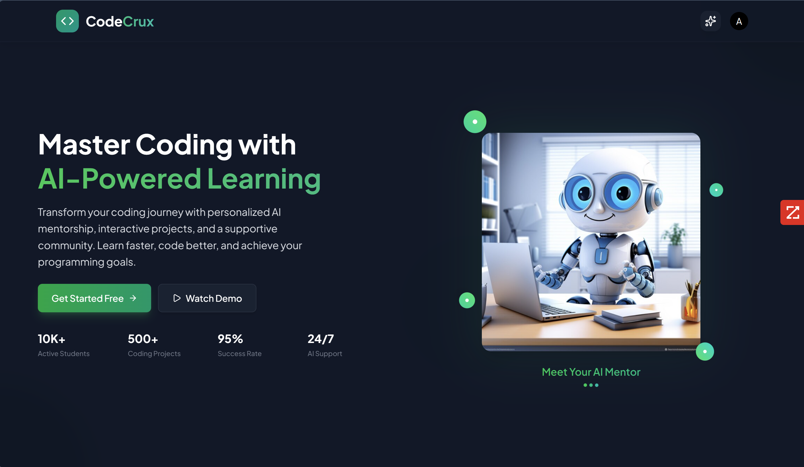

# 🚀 CodeCrux

<div align="center">

### *Your Ultimate Coding Companion*



[🚀 Live Demo](https://codecrux.vercel.app) • [📚 Documentation](#getting-started) • [🤝 Contributing](#contributing)

</div>

---

## 🌟 About

CodeCrux is a comprehensive learning platform for developers featuring AI-powered mentorship, curated tutorials, and progress tracking. Built with React, Node.js, and Google Gemini AI.

## ✨ Features

**📚 Learning Resources**
- 50+ curated video tutorials (DSA, algorithms, programming)
- 1000+ practice problems from top coding sheets (Striver's A2Z, Love Babbar)
- 6-stage structured learning roadmap
- Interactive coding challenges

**🤖 AI-Powered Assistance**
- 24/7 intelligent coding mentor using Google Gemini AI
- Real-time chat with code explanations
- Personalized learning recommendations
- Context-aware problem solving help

**📊 Progress Tracking**
- Comprehensive analytics dashboard
- Achievement system and milestones
- Learning streak tracking
- Performance insights

**🎨 User Experience**
- Dark/Light theme toggle
- Responsive design for all devices
- Real-time updates and notifications
- Advanced search and filtering

## 🏗️ Tech Stack

**🎨 Frontend Technologies**

- **⚛️ React 19.1.0**: Latest React with concurrent features and improved hooks
- **⚡ Vite 7.0.4**: Lightning-fast development server and optimized builds  
- **🎨 Tailwind CSS 4.1.11**: Utility-first CSS framework with custom theming
- **🧭 React Router 7.7.1**: Declarative routing with nested route support
- **🔔 React Toastify**: Beautiful toast notifications and alerts
- **📝 React Markdown**: Rich markdown rendering with syntax highlighting
- **🎯 Lucide React**: 1000+ beautiful, consistent icons
- **🌐 Axios**: Promise-based HTTP client with interceptors
- **🤖 Google GenAI**: Direct integration with Gemini AI for chat features

**🔧 Backend Architecture**

- **🚀 Node.js + Express 5.1.0**: Modern server-side JavaScript runtime
- **🗄️ MongoDB + Mongoose**: NoSQL database with elegant object modeling
- **🔐 Passport.js**: Robust authentication middleware with Google OAuth
- **🔑 JWT + bcryptjs**: Secure token-based authentication with password hashing
- **📧 Nodemailer**: Email service integration for notifications
- **🔧 Nodemon**: Auto-reload development server
- **🍪 Cookie Parser**: HTTP cookie parsing middleware
- **🌐 CORS**: Cross-origin resource sharing configuration

**🛠️ Development Tools**

- **📋 ESLint**: Code linting and style enforcement
- **🔄 Git**: Version control with branching strategies
- **🌍 dotenv**: Environment variable management
- **🧪 Development**: Hot reload, source maps, and debugging tools

## 📁 Project Structure

```
CodeCrux/
├── client/                 # React frontend
│   ├── src/
│   │   ├── components/     # UI components
│   │   ├── pages/         # Main pages
│   │   ├── contexts/      # React context
│   │   ├── data/          # Static data
│   │   └── hooks/         # Custom hooks
│   └── package.json
├── server/                # Express backend
│   ├── controllers/       # Business logic
│   ├── models/           # MongoDB models
│   ├── routes/           # API routes
│   ├── middleware/       # Auth middleware
│   └── config/           # DB & email config
└── img/                  # Project images
```

## 🚀 Getting Started

### Prerequisites
- Node.js (v18+)
- MongoDB (local or Atlas)
- Google OAuth credentials
- Google Gemini API key

### Installation

1. **Clone repository**
```bash
git clone https://github.com/aashutosh585/CodeCrux.git
cd CodeCrux
```

2. **Install dependencies**
```bash
# Backend
cd server && npm install

# Frontend
cd ../client && npm install
```

3. **Environment Setup**

Create `server/.env`:
```env
MONGODB_URI=mongodb://localhost:27017/codecrux
JWT_SECRET=your-jwt-secret
GOOGLE_CLIENT_ID=your-google-client-id
GOOGLE_CLIENT_SECRET=your-google-client-secret
GOOGLE_CALLBACK_URL=http://localhost:4000/api/auth/google/callback
EMAIL_HOST=smtp.gmail.com
EMAIL_PORT=587
EMAIL_USER=your-email@gmail.com
EMAIL_PASS=your-app-password
PORT=4000
```

Create `client/.env`:
```env
VITE_BACKEND_URL=http://localhost:4000
VITE_GEMINI_API_KEY=your-gemini-api-key
```

4. **Run Application**
```bash
# Backend (Terminal 1)
cd server && npm run server

# Frontend (Terminal 2)
cd client && npm run dev
```

Visit `http://localhost:5173` to see the app.

## 📚 API Endpoints

### Authentication
- `POST /api/auth/register` - User registration
- `POST /api/auth/login` - User login
- `POST /api/auth/logout` - User logout
- `GET /api/auth/google` - Google OAuth login
- `GET /api/auth/is-auth` - Check auth status
- `POST /api/auth/send-verify-otp` - Send verification OTP
- `POST /api/auth/verify-otp` - Verify email OTP
- `POST /api/auth/send-reset-otp` - Send password reset OTP
- `POST /api/auth/reset-password` - Reset password

### User Data
- `GET /api/user/data` - Get user profile and chat history
- `POST /api/user/chat/message` - Save chat message
- `POST /api/user/chat/history` - Bulk save chat history
- `DELETE /api/user/chat/history` - Clear chat history

## 🎯 Key Components

**Frontend**
- `Dashboard.jsx` - Main analytics dashboard
- `MentorAI.jsx` - AI chat interface
- `Tutorials.jsx` - Tutorial browsing
- `Sheet.jsx` - Practice sheets
- `RoadMap.jsx` - Learning roadmap
- `Profile.jsx` - User profile management

**Backend**
- `authController.js` - Authentication logic
- `userController.js` - User data management
- `userModel.js` - MongoDB user schema
- `userAuth.js` - JWT middleware

## 🔧 Development Scripts

**Client**
```bash
npm run dev        # Start development server
npm run build      # Build for production
npm run preview    # Preview production build
npm run lint       # Run ESLint
```

**Server**
```bash
npm run server     # Start with nodemon
npm start          # Start production server
```

## 🤝 Contributing

1. Fork the repository
2. Create feature branch (`git checkout -b feature/amazing-feature`)
3. Commit changes (`git commit -m 'Add amazing feature'`)
4. Push to branch (`git push origin feature/amazing-feature`)
5. Open Pull Request

## 👨‍💻 Author

**Ashutosh Maurya**
- GitHub: [@aashutosh585](https://github.com/aashutosh585)
- Email: aashutosh585@gmail.com

## 🙏 Acknowledgments

- Google Gemini AI for AI-powered features
- MongoDB for robust data persistence
- React & Vite for excellent development experience
- Tailwind CSS for beautiful responsive design
- Open source community for inspiration

<div align="center">

**Built with ❤️ for the coding community**

[⭐ Star this repo](https://github.com/aashutosh585/CodeCrux) • [🐛 Report Bug](https://github.com/aashutosh585/CodeCrux/issues) • [💡 Request Feature](https://github.com/aashutosh585/CodeCrux/issues)

</div>
</content>
</invoke>