<div align="center">

# 🚀 CodeCrux
### *Your Ultimate Coding Companion*


[](https://github.com/aashutosh585/CodeCrux)
[](https://github.com/aashutosh585/CodeCrux)
[](https://github.com/aashutosh585/CodeCrux/issues)
[](https://github.com/aashutosh585/CodeCrux)

**Transform your coding journey with AI-powered learning, curated content, and comprehensive progress tracking**

[🚀 Live Demo](https://codecrux.vercel.app) • [� Documentation](#-getting-started) • [💡 Features](#-what-makes-codecrux-special) • [🤝 Contributing](#-contributing)

</div>

---

## 🌟 What Makes CodeCrux Special?

CodeCrux is not just another coding platform—it's your personalized learning ecosystem that adapts to your journey from beginner to expert. Built with modern web technologies and powered by Google's Gemini AI, it offers an unparalleled coding education experience.

### 🎯 **Core Learning Features**
```yaml
📚 Curated Tutorials: 50+ hand-picked video tutorials covering DSA, algorithms, and programming concepts
📝 Practice Sheets: 1000+ problems from Striver's A2Z, Love Babbar, and other renowned coding sheets  
🛣️ Learning Roadmaps: Structured 6-stage journey from basics to advanced competitive programming
🤖 AI Mentor: 24/7 intelligent coding assistant powered by Google Gemini AI
📊 Progress Analytics: Comprehensive tracking of your learning milestones and achievements
```

### 🎨 **User Experience Excellence**
```yaml
🌙 Adaptive Themes: Seamless dark/light mode switching for comfortable coding sessions
📱 Responsive Design: Perfect experience across desktop, tablet, and mobile devices  
⚡ Real-time Updates: Live AI chat with streaming responses and instant progress updates
🔍 Smart Search: Advanced filtering across tutorials, sheets, and learning materials
💾 Cloud Persistence: Automatic saving of chat history, progress, and learning preferences
```

### �️ **Security & Performance**
```yaml
🔐 Secure Auth: JWT-based authentication with Google OAuth 2.0 integration
📧 Email Services: Automated verification and password reset functionality
🔄 Real-time Sync: MongoDB-powered data persistence with session management
🏗️ Scalable Architecture: Modern React + Node.js stack with modular component design
🌐 RESTful APIs: Well-documented endpoints with comprehensive error handling
```

## 📸 Application Showcase

<div align="center">

| 🖥️ **Dashboard & Analytics** | 🤖 **AI Mentor Experience** |
|:---:|:---:|
|  |  |
| *Track progress, analyze performance, view learning stats* | *Get instant help, explanations, and coding guidance* |

</div>

## 🏗️ Modern Tech Stack

<div align="center">

### **Frontend Arsenal**


### **Backend Infrastructure**  


### **AI & External Services**


</div>

### 🔧 **Technology Details**

<details>
<summary><strong>🎨 Frontend Technologies</strong></summary>

- **⚛️ React 19.1.0**: Latest React with concurrent features and improved hooks
- **⚡ Vite 7.0.4**: Lightning-fast development server and optimized builds  
- **🎨 Tailwind CSS 4.1.11**: Utility-first CSS framework with custom theming
- **🧭 React Router 7.7.1**: Declarative routing with nested route support
- **🔔 React Toastify**: Beautiful toast notifications and alerts
- **📝 React Markdown**: Rich markdown rendering with syntax highlighting
- **🎯 Lucide React**: 1000+ beautiful, consistent icons
- **🌐 Axios**: Promise-based HTTP client with interceptors
- **🤖 Google GenAI**: Direct integration with Gemini AI for chat features

</details>

<details>
<summary><strong>🔧 Backend Architecture</strong></summary>

- **🚀 Node.js + Express 5.1.0**: Modern server-side JavaScript runtime
- **🗄️ MongoDB + Mongoose**: NoSQL database with elegant object modeling
- **🔐 Passport.js**: Robust authentication middleware with Google OAuth
- **🔑 JWT + bcryptjs**: Secure token-based authentication with password hashing
- **📧 Nodemailer**: Email service integration for notifications
- **🔧 Nodemon**: Auto-reload development server
- **🍪 Cookie Parser**: HTTP cookie parsing middleware
- **🌐 CORS**: Cross-origin resource sharing configuration

</details>

<details>
<summary><strong>🛠️ Development Tools</strong></summary>

- **📋 ESLint**: Code linting and style enforcement
- **🔄 Git**: Version control with branching strategies
- **🌍 dotenv**: Environment variable management
- **🧪 Development**: Hot reload, source maps, and debugging tools

</details>

## 📁 Project Architecture

<div align="center">

### 🏗️ **System Architecture Overview**

```mermaid
graph TB
    A[👤 User Interface] --> B[⚛️ React Frontend]
    B --> C[🌐 REST API Layer]
    C --> D[🔧 Express.js Backend]
    D --> E[🗄️ MongoDB Database]
    D --> F[🤖 Google Gemini AI]
    D --> G[📧 Email Service]
    B --> H[🎨 Tailwind Styling]
    B --> I[🔄 Context State]
```



</div>

### 📂 **Detailed File Structure**

<details>
<summary><strong>🎨 Frontend Structure (/client)</strong></summary>

```
client/
├── 📁 public/                    # Static assets and favicon
├── 📁 src/
│   ├── 📄 App.jsx               # Main app component with routing
│   ├── � main.jsx              # React DOM rendering entry point  
│   ├── 📄 index.css             # Global styles and Tailwind imports
│   ├── 📁 components/           # Reusable UI components
│   │   ├── 📄 Dashboard.jsx     # Main dashboard with analytics
│   │   ├── � ChatInput.jsx     # AI chat input component
│   │   ├── 📄 ChatMessages.jsx  # Chat message display
│   │   ├── 📄 ChatSidebar.jsx   # Chat history sidebar
│   │   ├── 📄 Navbar.jsx        # Navigation bar
│   │   ├── 📄 Footer.jsx        # Site footer
│   │   ├── � Hero.jsx          # Landing page hero section
│   │   └── 📄 ...               # Additional UI components
│   ├── 📁 pages/                # Main application pages
│   │   ├── � Home.jsx          # Landing page
│   │   ├── 📄 Login.jsx         # Authentication page
│   │   ├── 📄 MentorAI.jsx      # AI mentor chat interface
│   │   ├── 📄 Tutorials.jsx     # Tutorial browsing page
│   │   ├── � Sheet.jsx         # Practice sheets page
│   │   ├── � RoadMap.jsx       # Learning roadmap page
│   │   └── 📄 Profile.jsx       # User profile management
│   ├── 📁 contexts/             # React Context providers
│   │   ├── 📄 AppContext.jsx    # Global app state
│   │   ├── 📄 DarkModeContext.jsx # Theme management
│   │   └── 📄 ProgressContext.jsx # Learning progress tracking
│   ├── 📁 data/                 # Static data and configurations
│   │   ├── � RoadmapData.jsx   # Learning roadmap structure
│   │   ├── 📄 SheetData.jsx     # Practice sheet information
│   │   └── 📄 TutorialData.jsx  # Tutorial catalog data
│   ├── �📁 hooks/                # Custom React hooks
│   │   └── � useAIMentor.js    # AI chat functionality hook
│   └── 📁 assets/               # Images, icons, and media files
├── 📄 package.json              # Dependencies and scripts
├── 📄 vite.config.js            # Vite configuration
└── 📄 eslint.config.js          # ESLint configuration
```

</details>

<details>
<summary><strong>🔧 Backend Structure (/server)</strong></summary>

```
server/
├── � server.js                 # Main server entry point
├── 📄 package.json              # Dependencies and scripts
├── 📁 config/                   # Configuration files
│   ├── � mongodb.js            # Database connection setup
│   └── 📄 nodemailer.js         # Email service configuration
├── 📁 controllers/              # Business logic handlers
│   ├── 📄 authController.js     # Authentication logic
│   └── 📄 userController.js     # User management and chat history
├── 📁 middleware/               # Custom middleware functions
│   └── 📄 userAuth.js           # JWT authentication middleware
├── 📁 models/                   # MongoDB data models
│   └── 📄 userModel.js          # User schema with chat history
├── 📁 routes/                   # API route definitions
│   ├── � authRoutes.js         # Authentication endpoints
│   └── 📄 userRoutes.js         # User data and chat endpoints
└── 📄 .env                      # Environment variables (not in repo)
```

</details>

### � **Data Flow Architecture**

1. **Authentication Flow**: User → Google OAuth/JWT → Protected Routes
2. **AI Chat Flow**: User Input → Frontend → Gemini AI → Response Stream → MongoDB Storage
3. **Progress Tracking**: User Actions → Context State → Local Storage → Analytics Dashboard
4. **Content Delivery**: Static Data → Component Rendering → Dynamic Filtering → User Interface

## 🚀 Quick Start Guide

### 📋 **Prerequisites Checklist**

Before diving in, ensure you have:

- ✅ **Node.js** (v18+ recommended) - [Download here](https://nodejs.org/)
- ✅ **MongoDB** - [Local install](https://www.mongodb.com/try/download/community) or [MongoDB Atlas](https://cloud.mongodb.com/)
- ✅ **Google Cloud Console Account** - For OAuth & Gemini AI
- ✅ **Git** - For cloning the repository

### ⚡ **One-Click Setup**

```bash
# 1️⃣ Clone and navigate
git clone https://github.com/aashutosh585/CodeCrux.git
cd CodeCrux

# 2️⃣ Install all dependencies
npm run install:all

# 3️⃣ Setup environment files
npm run setup:env

# 4️⃣ Start development servers
npm run dev:all
```

### � **Manual Installation**

<details>
<summary><strong>Step-by-step setup process</strong></summary>

#### **1. Clone Repository**
```bash
git clone https://github.com/aashutosh585/CodeCrux.git
cd CodeCrux
```

#### **2. Backend Setup**
```bash
cd server
npm install
```

#### **3. Frontend Setup**  
```bash
cd ../client
npm install
```

#### **4. Environment Configuration**
```bash
# Create environment files
touch server/.env
touch client/.env
```

</details>

### ⚙️ **Environment Configuration**

#### 🔧 **Server Configuration** (`server/.env`)

<details>
<summary><strong>📄 Complete server environment setup</strong></summary>

```bash
# ===== DATABASE CONFIGURATION =====
# Local MongoDB
MONGODB_URI=mongodb://localhost:27017/codecrux

# OR MongoDB Atlas (recommended for production)
MONGODB_URI=mongodb+srv://<username>:<password>@cluster.mongodb.net/codecrux

# ===== AUTHENTICATION SECRETS =====
JWT_SECRET=your-super-secure-jwt-secret-key-min-32-chars

# ===== GOOGLE OAUTH 2.0 =====
# Get from: https://console.cloud.google.com/
GOOGLE_CLIENT_ID=your-google-oauth-client-id
GOOGLE_CLIENT_SECRET=your-google-oauth-client-secret
GOOGLE_CALLBACK_URL=http://localhost:4000/api/auth/google/callback

# ===== EMAIL SERVICE (Gmail SMTP) =====
EMAIL_HOST=smtp.gmail.com
EMAIL_PORT=587
EMAIL_USER=your-email@gmail.com
EMAIL_PASS=your-gmail-app-password  # Generate from Google Account Settings

# ===== SERVER CONFIGURATION =====
PORT=4000
NODE_ENV=development
```

</details>

#### 🎨 **Client Configuration** (`client/.env`)

<details>
<summary><strong>📄 Frontend environment variables</strong></summary>

```bash
# ===== BACKEND API ENDPOINT =====
VITE_BACKEND_URL=http://localhost:4000

# ===== GOOGLE GEMINI AI =====
# Get API key from: https://aistudio.google.com/app/apikey
VITE_GEMINI_API_KEY=your-gemini-api-key

# ===== OPTIONAL CONFIGURATIONS =====
VITE_APP_NAME=CodeCrux
VITE_APP_VERSION=1.0.0
```

</details>

#### 🔑 **API Keys Setup Guide**

<details>
<summary><strong>🗝️ How to obtain required API keys</strong></summary>

**1. Google OAuth Setup:**
- Visit [Google Cloud Console](https://console.cloud.google.com/)
- Create new project or select existing one
- Enable Google+ API and OAuth consent screen
- Create OAuth 2.0 credentials (Web application)
- Add `http://localhost:4000/api/auth/google/callback` to authorized redirect URIs

**2. Google Gemini AI:**
- Go to [Google AI Studio](https://aistudio.google.com/app/apikey)
- Create new API key
- Copy the generated key

**3. Gmail App Password:**
- Enable 2-Step Verification on your Google account
- Generate app-specific password from Account Settings
- Use this password (not your regular password)

**4. MongoDB Atlas (Optional):**
- Create account at [MongoDB Atlas](https://cloud.mongodb.com/)
- Create new cluster
- Get connection string from "Connect" button

</details>

### 🏃‍♂️ **Launch Your Development Environment**

#### 🚀 **Development Mode** (Recommended)

<div align="center">

| 🔧 **Backend Server** | 🎨 **Frontend App** |
|:---:|:---:|
|  |  |
| *Express.js + MongoDB + AI Services* | *React + Vite + Tailwind CSS* |

</div>

**Option 1: Concurrent Development (Recommended)**
```bash
# 🚀 Start both servers simultaneously
npm run dev:all

# This will run:
# ✅ Backend server on http://localhost:4000
# ✅ Frontend app on http://localhost:5173
# ✅ MongoDB connection
# ✅ Hot reload for both environments
```

**Option 2: Manual Startup**
```bash
# Terminal 1 - Backend Server
cd server
npm run server
# ✅ API server running on http://localhost:4000

# Terminal 2 - Frontend App  
cd client
npm run dev  
# ✅ React app running on http://localhost:5173
```

#### 🎯 **Production Mode**

<details>
<summary><strong>🏭 Production deployment steps</strong></summary>

**Build & Deploy:**
```bash
# 1️⃣ Build optimized frontend
cd client
npm run build

# 2️⃣ Start production server
cd ../server
NODE_ENV=production npm start

# 3️⃣ Optional: Use PM2 for process management
npm install -g pm2
pm2 start server.js --name "codecrux-api"
```

**Environment Variables for Production:**
```bash
NODE_ENV=production
MONGODB_URI=mongodb+srv://...  # Use Atlas for production
GOOGLE_CALLBACK_URL=https://yourdomain.com/api/auth/google/callback
```

</details>

#### ⚡ **Quick Development Scripts**

```bash
# 📦 Install dependencies for both client & server
npm run install:all

# 🔄 Start development servers
npm run dev:all

# 🧹 Clean node_modules and reinstall
npm run clean:install

# 🧪 Run linting
npm run lint:all

# 🏗️ Build for production
npm run build:all
```

## 📚 **Comprehensive API Documentation**

### 🔐 **Authentication Endpoints**

<details>
<summary><strong>🔑 User Authentication & Management</strong></summary>

| Method | Endpoint | Description | Auth Required |
|--------|----------|-------------|---------------|
| `POST` | `/api/auth/register` | Create new user account | ❌ |
| `POST` | `/api/auth/login` | User login with email/password | ❌ |
| `POST` | `/api/auth/logout` | User logout and token cleanup | ✅ |
| `GET` | `/api/auth/google` | Initiate Google OAuth login | ❌ |
| `GET` | `/api/auth/google/callback` | Google OAuth callback handler | ❌ |
| `GET` | `/api/auth/is-auth` | Check current authentication status | ✅ |

**Request/Response Examples:**
```javascript
// Registration
POST /api/auth/register
{
  "name": "John Doe",
  "email": "john@example.com", 
  "password": "securePassword123"
}

// Response
{
  "success": true,
  "message": "Registration successful",
  "userId": "64a7b8c9d1e2f3g4h5i6j7k8"
}
```

</details>

<details>
<summary><strong>📧 Email Verification & Password Reset</strong></summary>

| Method | Endpoint | Description | Auth Required |
|--------|----------|-------------|---------------|
| `POST` | `/api/auth/send-verify-otp` | Send email verification OTP | ✅ |
| `POST` | `/api/auth/verify-otp` | Verify email with OTP code | ✅ |
| `POST` | `/api/auth/send-reset-otp` | Send password reset OTP | ❌ |
| `POST` | `/api/auth/reset-password` | Reset password with OTP | ❌ |

**Email Verification Flow:**
```javascript
// Send OTP
POST /api/auth/send-verify-otp
Headers: { Authorization: "Bearer <jwt_token>" }

// Verify OTP
POST /api/auth/verify-otp  
{
  "otp": "123456"
}
```

</details>

### 👤 **User Data & Chat Management**

<details>
<summary><strong>📊 User Profile & Chat History</strong></summary>

| Method | Endpoint | Description | Auth Required |
|--------|----------|-------------|---------------|
| `GET` | `/api/user/data` | Get user profile and chat history | ✅ |
| `POST` | `/api/user/chat/message` | Save individual chat message | ✅ |
| `POST` | `/api/user/chat/history` | Bulk save chat conversation | ✅ |
| `DELETE` | `/api/user/chat/history` | Clear all user chat history | ✅ |

**Chat Message Structure:**
```javascript
// Save chat message
POST /api/user/chat/message
{
  "role": "user",           // "user" or "model"
  "content": "Explain binary search algorithm",
  "timestamp": "2024-01-15T10:30:00Z"
}

// Bulk save conversation
POST /api/user/chat/history
{
  "messages": [
    {
      "role": "user",
      "content": "What is recursion?",
      "timestamp": "2024-01-15T10:30:00Z"
    },
    {
      "role": "model", 
      "content": "Recursion is a programming technique...",
      "timestamp": "2024-01-15T10:30:15Z"
    }
  ]
}
```

</details>

### 🔧 **API Usage Examples**

<details>
<summary><strong>📋 Complete integration examples</strong></summary>

**Authentication Headers:**
```javascript
// Required for protected endpoints
const headers = {
  'Authorization': `Bearer ${localStorage.getItem('token')}`,
  'Content-Type': 'application/json'
}
```

**Error Handling:**
```javascript
// Standard error response format
{
  "success": false,
  "message": "User not found",
  "error": "USER_NOT_FOUND",
  "timestamp": "2024-01-15T10:30:00Z"
}
```

**Rate Limiting:**
- Authentication endpoints: 5 requests/minute
- Chat endpoints: 50 requests/minute  
- General endpoints: 100 requests/minute

</details>

## 🎯 **Application Features Deep Dive**

### 🖥️ **Frontend Application Components**

<div align="center">

| 📊 **Dashboard** | 🤖 **AI Mentor** | 📚 **Learning Hub** |
|:---:|:---:|:---:|
|  |  |  |
| *Progress Analytics* | *Real-time AI Chat* | *Curated Content* |

</div>

<details>
<summary><strong>🎨 Core UI Components</strong></summary>

#### **📊 Dashboard & Analytics**
- **Progress Summary**: Track completed tutorials, sheets, and AI sessions
- **Performance Metrics**: Visual charts showing learning progress over time
- **Achievement System**: Unlock badges and milestones for motivation
- **Recent Activity**: Quick access to recent tutorials and chat sessions

#### **🤖 AI Mentor Interface**
- **Streaming Responses**: Real-time AI chat with typing indicators
- **Code Syntax Highlighting**: Automatic formatting for code blocks
- **Chat History Sidebar**: Organized conversation management
- **Context Awareness**: AI remembers previous conversation context

#### **📚 Learning Resources**
- **Tutorial Browser**: Filterable grid of video tutorials with ratings
- **Practice Sheets**: Curated problem sets from industry experts
- **Roadmap Visualization**: Interactive learning path with progress tracking
- **Search & Filter**: Advanced filtering by difficulty, topic, and duration

#### **👤 User Experience**
- **Responsive Design**: Seamless experience across all device sizes
- **Dark/Light Themes**: Toggle between comfortable viewing modes
- **Profile Management**: Update preferences and view learning statistics
- **Authentication Flow**: Smooth Google OAuth and email verification

</details>

### 🔧 **Backend Architecture & Services**

<details>
<summary><strong>🏗️ Server-side Implementation</strong></summary>

#### **🔐 Authentication System**
```javascript
// JWT-based authentication with Google OAuth
const authFlow = {
  registration: "Email/Password + Email Verification",
  login: "JWT Token Generation + Cookie Storage",
  googleOAuth: "Passport.js Integration + Profile Sync",
  security: "bcrypt Password Hashing + Session Management"
}
```

#### **💾 Data Management**
```javascript
// MongoDB collections and schemas
const dataModels = {
  users: {
    profile: "name, email, verification status",
    authentication: "password hash, OAuth data",
    chatHistory: "AI conversations with timestamps",
    progress: "completed tutorials, achievements"
  }
}
```

#### **🤖 AI Integration**
- **Google Gemini AI**: Direct API integration for chat responses
- **Streaming Responses**: Real-time message delivery to frontend
- **Context Management**: Conversation history for coherent interactions
- **Error Handling**: Graceful fallbacks for API limitations

#### **📧 Communication Services**
- **NodeMailer Integration**: Email verification and password reset
- **Template System**: HTML email templates for different actions
- **SMTP Configuration**: Gmail integration with app passwords
- **Queue Management**: Async email sending with retry logic

</details>

### 🔄 **Real-time Features**

<details>
<summary><strong>⚡ Live Updates & Interactions</strong></summary>

#### **💬 Chat System**
- Real-time AI responses with streaming
- Automatic message persistence to MongoDB
- Chat history synchronization across devices
- Typing indicators and message status

#### **📊 Progress Tracking**
- Live updates of completion status
- Real-time achievement notifications
- Progress bar animations and transitions
- Automatic saving of learning milestones

#### **🔄 State Management**
- React Context for global state
- Local storage for offline persistence
- Optimistic updates for better UX
- Error boundaries for graceful failures

</details>

## 🔧 **Development Guide**

### 📜 **Available Scripts**

<details>
<summary><strong>🎨 Frontend Development Scripts</strong></summary>

```bash
# 🚀 Development
npm run dev          # Start Vite dev server with HMR
npm run dev:host     # Start dev server accessible on network
npm run dev:debug    # Start with debugging enabled

# 🏗️ Build & Preview  
npm run build        # Build optimized production bundle
npm run preview      # Preview production build locally
npm run analyze      # Analyze bundle size and dependencies

# 🧹 Code Quality
npm run lint         # Run ESLint for code quality
npm run lint:fix     # Auto-fix linting issues
npm run format       # Format code with Prettier
npm run type-check   # Run TypeScript type checking
```

</details>

<details>
<summary><strong>🔧 Backend Development Scripts</strong></summary>

```bash
# 🚀 Development
npm run server       # Start with nodemon (auto-reload)
npm run dev          # Development mode with debugging
npm run debug        # Start with Node.js debugger

# 🏭 Production
npm start            # Start production server
npm run pm2:start    # Start with PM2 process manager
npm run pm2:stop     # Stop PM2 processes

# 🧪 Testing & Quality
npm run test         # Run test suites
npm run test:watch   # Run tests in watch mode
npm run coverage     # Generate test coverage report
```

</details>

<details>
<summary><strong>🔄 Root Project Scripts</strong></summary>

```bash
# 📦 Setup & Installation
npm run install:all    # Install dependencies for both client & server
npm run clean:install  # Clean node_modules and reinstall
npm run setup:env      # Interactive environment setup

# 🚀 Development
npm run dev:all        # Start both client and server concurrently
npm run build:all      # Build both applications
npm run lint:all       # Lint both codebases

# 🧹 Maintenance
npm run clean          # Remove build files and node_modules
npm run update         # Update all dependencies
npm run security:audit # Run security audit
```

</details>

### 📏 **Code Standards & Best Practices**

<details>
<summary><strong>🎯 Development Guidelines</strong></summary>

#### **🏗️ Architecture Principles**
```javascript
// ✅ Component Structure
const ComponentName = () => {
  // 1. Hooks and state
  // 2. Event handlers  
  // 3. Effects
  // 4. Render logic
  return <JSX />
}

// ✅ Custom Hooks Pattern
const useFeatureName = () => {
  // Encapsulate related logic
  // Return interface objects
  return { data, actions, state }
}
```

#### **📝 Code Style Guidelines**
- **ESLint + Prettier**: Automated code formatting and linting
- **Naming Conventions**: camelCase for variables, PascalCase for components
- **File Organization**: Group by feature, not by file type
- **Import Structure**: External → Internal → Relative imports
- **Component Props**: Use TypeScript interfaces for prop definitions

#### **🔧 Performance Best Practices**
- **React.memo**: Memoize expensive components
- **useMemo/useCallback**: Cache expensive calculations
- **Code Splitting**: Lazy load components and pages
- **Bundle Optimization**: Tree shaking and dead code elimination

#### **🧪 Testing Standards**
- **Unit Tests**: Test individual components and functions
- **Integration Tests**: Test component interactions
- **E2E Tests**: Test complete user workflows
- **Coverage Target**: Maintain >80% test coverage

</details>

### 🔄 **Development Workflow**

<details>
<summary><strong>📋 Recommended development process</strong></summary>

#### **🌿 Git Workflow**
```bash
# Feature development
git checkout -b feature/new-awesome-feature
git add .
git commit -m "feat: add awesome new feature"
git push origin feature/new-awesome-feature

# Create pull request for review
```

#### **📝 Commit Message Format**
```bash
feat: add new AI chat functionality
fix: resolve authentication token expiry
docs: update API documentation
style: improve responsive design
refactor: optimize database queries
test: add unit tests for user service
```

#### **🔍 Code Review Checklist**
- ✅ Code follows established patterns
- ✅ No console.logs in production code
- ✅ Error handling implemented
- ✅ Performance considerations addressed
- ✅ Tests added for new functionality
- ✅ Documentation updated

</details>

## 🤝 **Contributing to CodeCrux**

We welcome contributions from developers of all skill levels! Here's how you can help make CodeCrux even better.

### 🚀 **Quick Contribution Guide**

<details>
<summary><strong>📋 Step-by-step contribution process</strong></summary>

#### **1️⃣ Fork & Setup**
```bash
# Fork the repository on GitHub
gh repo fork aashutosh585/CodeCrux

# Clone your fork
git clone https://github.com/YOUR-USERNAME/CodeCrux.git
cd CodeCrux

# Add upstream remote
git remote add upstream https://github.com/aashutosh585/CodeCrux.git
```

#### **2️⃣ Create Feature Branch**
```bash
# Create and switch to feature branch
git checkout -b feature/your-awesome-feature

# Or for bug fixes
git checkout -b fix/bug-description
```

#### **3️⃣ Development Process**
```bash
# Install dependencies
npm run install:all

# Start development environment
npm run dev:all

# Make your changes and test thoroughly
npm run lint:all
npm run test:all
```

#### **4️⃣ Commit & Push**
```bash
# Stage and commit changes
git add .
git commit -m "feat: add your awesome feature description"

# Push to your fork
git push origin feature/your-awesome-feature
```

#### **5️⃣ Create Pull Request**
- Open a pull request from your fork to the main repository
- Fill out the PR template with detailed description
- Link any related issues
- Wait for code review and feedback

</details>

### 🎯 **Contribution Areas**

<div align="center">

| 🐛 **Bug Fixes** | ✨ **New Features** | 📚 **Documentation** | 🧪 **Testing** |
|:---:|:---:|:---:|:---:|
| Fix reported issues | Add new functionality | Improve docs | Write tests |
| [Open Issues](https://github.com/aashutosh585/CodeCrux/issues?q=is%3Aissue+is%3Aopen+label%3Abug) | [Feature Requests](https://github.com/aashutosh585/CodeCrux/issues?q=is%3Aissue+is%3Aopen+label%3Aenhancement) | [Docs Issues](https://github.com/aashutosh585/CodeCrux/issues?q=is%3Aissue+is%3Aopen+label%3Adocumentation) | [Testing Issues](https://github.com/aashutosh585/CodeCrux/issues?q=is%3Aissue+is%3Aopen+label%3Atesting) |

</div>

<details>
<summary><strong>💡 Ideas for contributions</strong></summary>

**🔧 Technical Improvements:**
- Add TypeScript support for better type safety
- Implement comprehensive testing suite
- Optimize performance and bundle size
- Add Docker containerization
- Improve error handling and logging

**🎨 UI/UX Enhancements:**
- Mobile app development (React Native)
- Improve accessibility features
- Add more themes and customization
- Create interactive tutorials
- Enhance responsive design

**📈 Feature Additions:**
- Code playground integration
- Collaborative coding features
- Advanced analytics dashboard
- Gamification system
- Community features and forums

</details>

## 👨‍💻 **Project Team**

<div align="center">

### **Lead Developer**
[](https://github.com/aashutosh585)

**[Ashutosh Maurya](https://github.com/aashutosh585)**  
*Full-Stack Developer & Project Creator*

📧 Contact: [Email](mailto:aashutosh585@gmail.com) • 🐙 [GitHub](https://github.com/aashutosh585) • 💼 [LinkedIn](https://linkedin.com/in/aashutosh585)

</div>

## 🙏 **Acknowledgments**

<div align="center">

### **Special Thanks To**

| Technology | Purpose | Website |
|:---:|:---:|:---:|
|  | **Gemini AI** for intelligent coding assistance | [Google AI](https://ai.google/) |
|  | **MongoDB** for robust data persistence | [MongoDB](https://mongodb.com/) |
|  | **React & Vite** for exceptional developer experience | [React](https://react.dev/) |
|  | **Tailwind CSS** for beautiful, responsive design | [Tailwind](https://tailwindcss.com/) |

### **Community Contributors**
*Thanks to all the developers who have contributed to making CodeCrux better!*

[](https://github.com/aashutosh585/CodeCrux/graphs/contributors)

</div>

## 🔮 **Roadmap & Future Vision**

<details>
<summary><strong>🚀 Upcoming Features & Improvements</strong></summary>

### **🎯 Phase 1: Enhanced Learning Experience**
- [ ] **Interactive Code Playground**: In-browser coding environment
- [ ] **Video Tutorial Integration**: Embedded YouTube player with notes
- [ ] **Progress Gamification**: Achievement badges and leaderboards
- [ ] **Advanced Search**: AI-powered content discovery
- [ ] **Offline Mode**: Download tutorials for offline learning

### **� Phase 2: Mobile & Accessibility**
- [ ] **React Native App**: Full-featured mobile application
- [ ] **PWA Support**: Progressive Web App capabilities
- [ ] **Accessibility**: WCAG 2.1 compliance and screen reader support
- [ ] **Multi-language**: Internationalization support
- [ ] **Voice Assistant**: Voice-controlled navigation and AI chat

### **🤝 Phase 3: Community & Collaboration**
- [ ] **Study Groups**: Collaborative learning spaces
- [ ] **Code Reviews**: Peer-to-peer code feedback system
- [ ] **Discussion Forums**: Community Q&A and knowledge sharing
- [ ] **Mentorship Program**: Connect experienced developers with learners
- [ ] **Competition Platform**: Coding contests and challenges

### **📊 Phase 4: Advanced Analytics & AI**
- [ ] **Learning Analytics**: Detailed performance insights and recommendations
- [ ] **Personalized AI Tutor**: Adaptive learning paths based on progress
- [ ] **Code Analysis**: Automated code review and suggestions
- [ ] **Career Guidance**: Job recommendation based on skills and progress
- [ ] **Enterprise Features**: Team management and corporate training tools

</details>

---

<div align="center">

## � **Project Stats & Recognition**


## 📸 **Visual Feature Gallery**

### 🖥️ **Complete Application Experience**

<table>
<tr>
<td align="center" width="50%">
<h4>🎨 Dashboard & Analytics</h4>

<p><em>Comprehensive progress tracking with beautiful visualizations</em></p>
</td>
<td align="center" width="50%">
<h4>🤖 AI Mentor Assistant</h4>

<p><em>Intelligent coding assistant powered by Google Gemini AI</em></p>
</td>
</tr>
</table>

### ✨ **Key Features Spotlight**

| 🎯 **Learning Hub** | 📊 **Progress Tracking** | 🌙 **Theme Support** |
|:---:|:---:|:---:|
| Curated tutorials & sheets | Real-time analytics | Dark & Light modes |
| 📚 1000+ Problems | 📈 Visual Progress | 🎨 Beautiful UI |

## 🌟 **Why Choose CodeCrux?**

<div align="left">

**🎯 For Students:**
- Structured learning paths from beginner to expert
- AI-powered assistance available 24/7
- Progress tracking to stay motivated
- Free access to premium coding resources

**🏢 For Educators:**
- Ready-to-use curriculum and teaching materials
- Student progress monitoring capabilities
- Interactive learning environment
- Community-driven content updates

**💼 For Professionals:**
- Interview preparation with curated problems
- Skill gap analysis and improvement suggestions
- Latest industry trends and best practices
- Networking with other developers

</div>

## 🚀 **Get Started Today**

<div align="center">

### **Ready to Transform Your Coding Journey?**

[](https://codecrux.vercel.app)
[](#-quick-start-guide)
[](#-contributing-to-codecrux)

---

**Built with ❤️ for the global coding community**

*Empowering developers worldwide to achieve their coding dreams*

### **Quick Links**

[⭐ Star Repository](https://github.com/aashutosh585/CodeCrux/stargazers) • 
[🐛 Report Issues](https://github.com/aashutosh585/CodeCrux/issues) • 
[💡 Request Features](https://github.com/aashutosh585/CodeCrux/issues/new) • 
[📖 Documentation](https://github.com/aashutosh585/CodeCrux/wiki) • 
[💬 Discussions](https://github.com/aashutosh585/CodeCrux/discussions)

---

**© 2024 CodeCrux. Made with passion by [Ashutosh Maurya](https://github.com/aashutosh585)**

*"Every expert was once a beginner. Every pro was once an amateur."*

</div>
